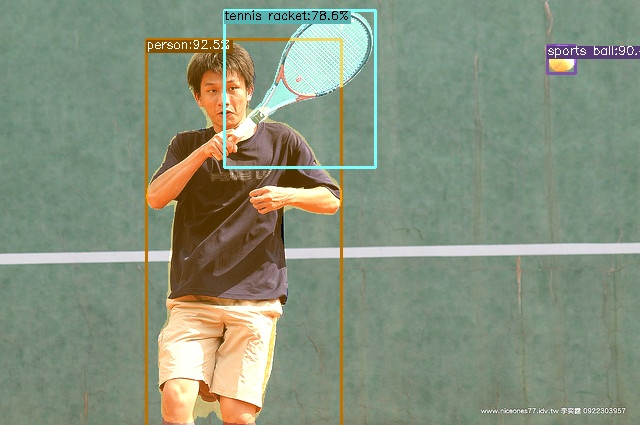

**YOLOX CondInst -- YOLOX 实例分割**
============================

***

***
#
In order to facilitate script management, I have integrated the code into [YOLOX-OBB](https://github.com/DDGRCF/YOLOX_OBB)
#
## **前言**
1. 本项目是自己学习实例分割时，复现的代码. 通过自己编程，让自己对实例分割有更进一步的了解。
若想与本人探讨有关深度学习的相关知识，欢迎通过邮件交流
2. 后续想解决模型的部署问题(c++)
3. 后续想继续安装其他实例分割的代码

## **Update**
0. waiting ...
## **Some Ideas**
1. 在写推理的代码的时候，为了兼容eval的代码将做了很多split和cat的操作，这减慢了检测的速度，如果单纯想进行推理，可以将这部分的操作简化
2. fp16模型存在问题，等待解决

## **Introduction**
1. For YOLOX, I change some codes and it will lead speed up. 
2. For CondInst, I just follow [AdelaiDet](https://github.com/aim-uofa/AdelaiDet.git) and keep the same parameters as it.
## **Content**

- [Quick&nbsp;Start](#Quick&nbsp;Start)
- [Instruction](#Instruction)
  - [Data](#Data)
  - [Demo](#Demo)
  - [Train](#Train)
  - [Test](#Test)

- [Ralated&nbsp;Hub](#Ralated&nbsp;Hub)

## **Quick&nbsp;Start**

Firstly, create python environment

```shell
$ conda create -n yolox_inst python=3.7 -y
```

Then, clone the github of the item

```shell
$ git clone https://github.com/DDGRCF/YOLOX-CondInst.git
```
Then, you can adjust follow the [original quick start](./docs/quick_run.md) 

## **Instruction**
### **Demo**
I prepare the shell the demo script so that you can quickly run obb demo as:
```shell
$ cd my_exps
$ bash demo_inst.sh 0 /path/to/you
# PS: 0 is to assign the train environment to 0 gpu, you can change it by youself and /path/to/you is your demo images.
```
 
### **Train**
I define the model default training parameters as following:

| model | max epoch | enable_mixup  | enable_mosaic |no aug epoch |
| :-:   | :-:       | :-:           |:-:            |:-:          |
|yolox_s| 24        | True          | True          |5            |

| cls_loss_weight | obj_loss_weight | iou_loss_weight  | reg_loss_weight | mask_loss_weight |
| :-:             | :-:             | :-:              | :-:             | :-:              |
| 1.0             | 1.0             | 5.0              | 1.0             | 5.0              |

Of course, this group parameters is not the best one, so you can try youself. And for the quick train, I have prepare the shell scripts, too.

```shell
$ cd my_exps
$ bash train_dota_obb.sh  0
```
As I set parameters above with 16 batch size per gpu (2gpu), the lresults on val dataset show as following:
waiting ...

### **Test**
I just follow original evaluation to test and eval
```shell
$ cd my_exps
$ ./eval_dota_obb.sh eval/test 0
# PS: for convenience, I set default parameters. So, eval means evaluating COCO val datasets.
```
## **Ralated&nbsp;Hub**

- [YOLOX](https://github.com/Megvii-BaseDetection/YOLOX.git)

- [AdelaiDet](https://github.com/aim-uofa/AdelaiDet.git)
